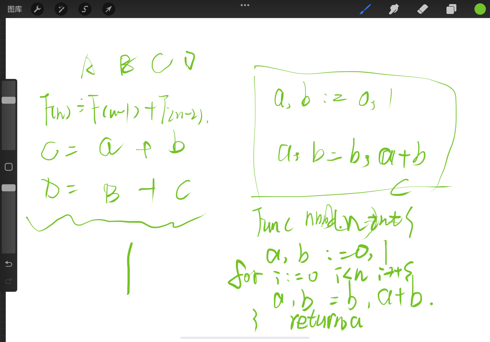

### 传送门：[509.FibonacciNumber](https://leetcode.cn/problems/fibonacci-number/)
> 非 Array 类型的题。
---

# Zhengcai You
```c++

    // Recursion O(n)
    static int fibRecursion(int N){
        if (N<2) return N;
        return fibRecursion(N-1) + fibRecursion(N-2); // 通用公式
    }
    // 509.Fibonacci Number
    // use Dynamic Programming
    // DP 5 step:
    // 1. 确定dp数组（dp table）以及下标的含义: dp[i],第i个数的斐波那契数值是 dp[i]
    // 2. 确定递推公式: 状态转移方程 dp[i] = dp[i-1] + dp[i-2]
    // 3. dp数组如何初始化 : dp[0] = 0;dp[1] = 1;
    // 4. 确定遍历顺序: 从前到后依次
    // 5. 举例推导dp数组： 根据递推公司，模拟推导 N = 10 时 DP数列为： 0,1,1,2,3,5,8,13,21,34,55 然后写代码验证这个 dp数组
    static int fibDP(int N) {
        if (N <= 1) return N;
        vector<int> dp(N+1); // 1. 确定 dp 数组
        dp[0] = 0;
        dp[1] = 1; // 3. 初始化dp数组
        for (int i = 2; i <= N; ++i) {  // 4. 遍历顺序
            dp[i] = dp[i-1] + dp[i-2];  // 5. dp 数组
        }
        return dp[N];
    }
    // DP 优化版 ： 只关注每一轮需要的值 dp[i-1] 和 dp[i-2]
    static int fibDPSimple(int N) {
        if (N <= 1) return N;
        int dp[2];// 1. 确定 dp 数组
        dp[0] = 0;
        dp[1] = 1; // 3. 初始化dp数组
        for (int i = 2; i <= N; ++i) {  // 4. 遍历顺序
            int sum = dp[0] + dp[1]; // 相当于 dp[2]
            dp[0] = dp[1];
            dp[1] = sum;
        }
        return dp[1];
    }
```
# SONGLIU
```Go
func fib(n int) int {
    a,b := 0,1
    for i:=0; i<n; i++{
        a,b = b,a+b
    }
    return a
}
```

